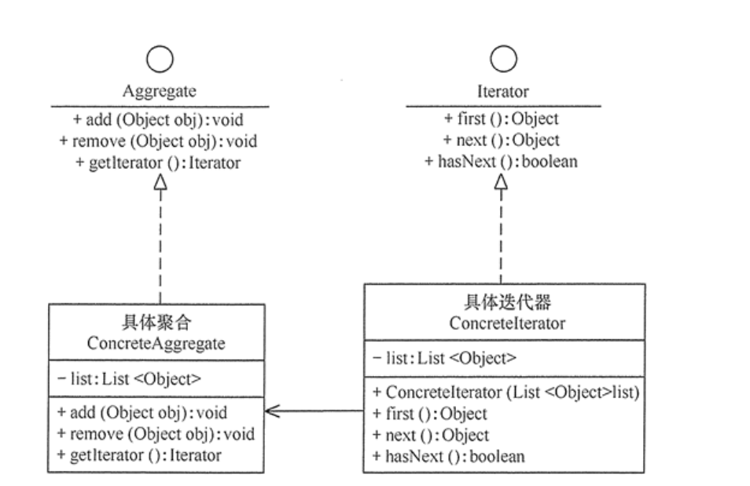
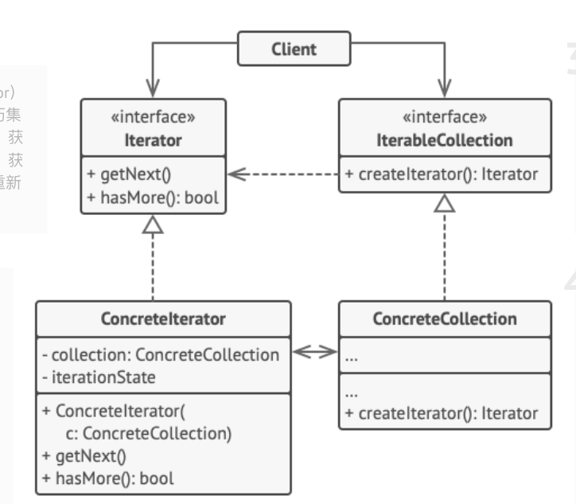
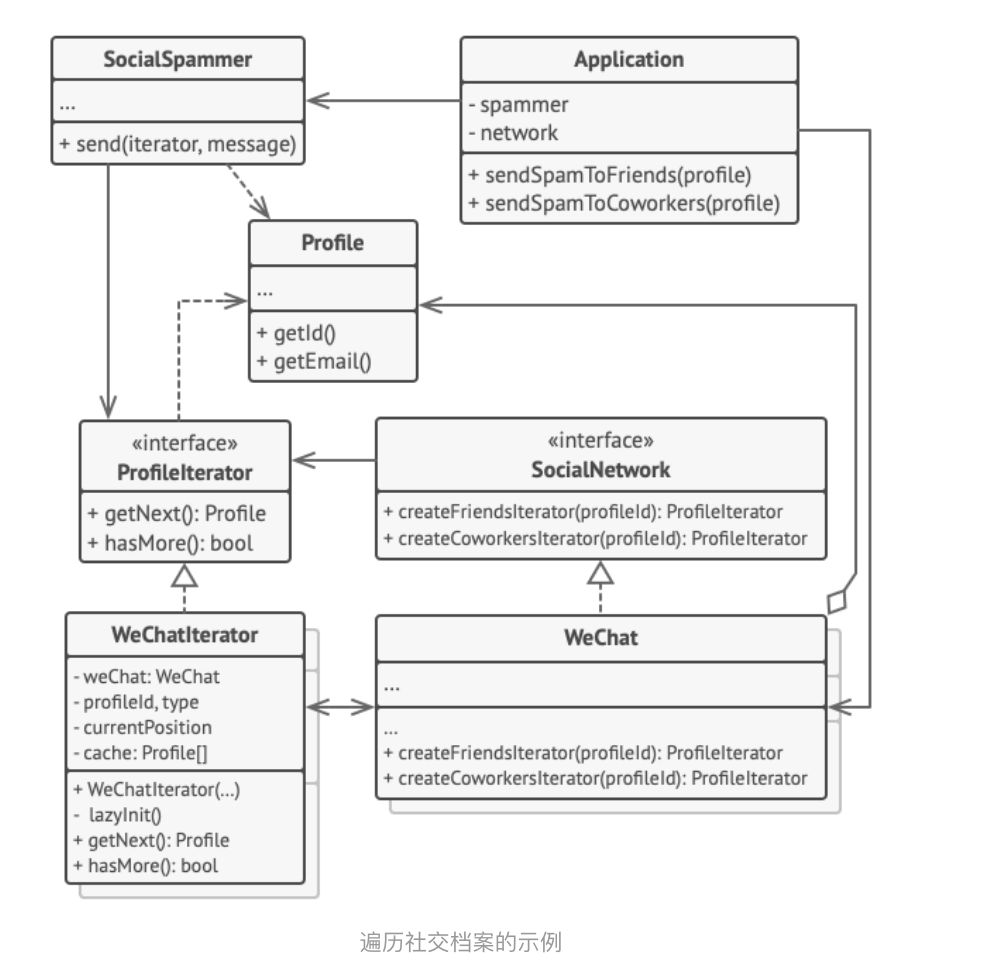

# 迭代器模式 Iterator pattern

### 1. 定义与特点

定义: **提供一个对象来顺序访问聚合对象中的一系列数据，而不暴露聚合对象的内部表示**

特点:

1. 访问一个聚合对象的内容而无须暴露它的内部表示
2. 遍历任务交由迭代器完成，这简化了聚合类
3. 它支持以不同方式遍历一个聚合，甚至可以自定义迭代器的子类以支持新的遍历
4. 增加新的聚合类和迭代器类都很方便，无须修改原有代码
5. 封装性良好，为遍历不同的聚合结构提供一个统一的接口

### 2. 结构

迭代器模式是通过将聚合对象的遍历行为分离出来，抽象成迭代器类来实现的，其目的是在不暴露聚合对象的内部结构的情况下，让外部代码透明地访问聚合的内部数据

1. 抽象聚合（Aggregate）角色：定义存储、添加、删除聚合对象以及创建迭代器对象的接口
2. 具体聚合（ConcreteAggregate）角色：实现抽象聚合类，返回一个具体迭代器的实例
3. 抽象迭代器（Iterator）角色：定义访问和遍历聚合元素的接口，通常包含 hasNext()、first()、next() 等方法
4. 具体迭代器（ConcreteIterator）角色：实现抽象迭代器接口中所定义的方法，完成对聚合对象的遍历，记录遍历的当前位置



### 3. 实现

```java

// 抽象聚合
interface Aggregate {
    public void add(Object obj);

    public void remove(Object obj);

    public Iterator getIterator();
}

// 具体聚合
class ConcreteAggregate implements Aggregate {
    private List<Object> list = new ArrayList<Object>();

    public void add(Object obj) {
        list.add(obj);
    }

    public void remove(Object obj) {
        list.remove(obj);
    }

    public Iterator getIterator() {
        return (new ConcreteIterator(list));
    }
}

// 抽象迭代器
interface Iterator {
    Object first();

    Object next();

    boolean hasNext();
}

//具体迭代器
class ConcreteIterator implements Iterator {
    private List<Object> list = null;
    private int index = -1;

    public ConcreteIterator(List<Object> list) {
        this.list = list;
    }

    public boolean hasNext() {
        if (index < list.size() - 1) {
            return true;
        } else {
            return false;
        }
    }

    public Object first() {
        index = 0;
        Object obj = list.get(index);
        ;
        return obj;
    }

    public Object next() {
        Object obj = null;
        if (this.hasNext()) {
            obj = list.get(++index);
        }
        return obj;
    }
}

```

输出

```java

public class IteratorPattern {
    public static void main(String[] args) {
        Aggregate ag = new ConcreteAggregate();
        ag.add("中山大学");
        ag.add("华南理工");
        ag.add("韶关学院");
        System.out.print("聚合的内容有：");
        Iterator it = ag.getIterator();
        while (it.hasNext()) {
            Object ob = it.next();
            System.out.print(ob.toString() + "\t");
        }
        Object ob = it.first();
        System.out.println("\nFirst：" + ob.toString());
    }
}

```

https://refactoringguru.cn/design-patterns/code.iterator

### 4. 案例

#### 4.1 结构



##### 1. 迭代器 (Iterator)

接口声明了遍历集合所需的操作： 获取下一个元素、 获取当前位置和重新开始迭代等

##### 2. 具体迭代器 (ConcreteIterator)

实现遍历集合的一种特定算法。 迭代器对象必须跟踪自身遍历的进度。 这使得多个迭代器可以相互独立地遍历同一集合

##### 3. 集合 (Collection)

接口声明一个或多个方法来获取与集合兼容的迭代器。 请注意， 返回方法的类型必须被声明为迭代器接口， 因此具体集合可以返回各种不同种类的迭代器

#### 4. 具体集合 (Concrete Collections)

会在客户端请求迭代器时返回一个特定的具体迭代器类实体。 你可能会琢磨， 剩下的集合代码在什么地方呢？ 不用担心， 它也会在同一个类中。 只是这些细节对于实际模式来说并不重要， 所以我们将其省略了而已

#### 4.2 伪代码

迭代器模式用于遍历一个封装了访问微信好友关系功能的特殊集合。 该集合提供使用不同方式遍历档案资料的多个迭代器



#### 4.3 实现

“好友 （friends）” 迭代器可用于遍历指定档案的好友。 “同事 （colleagues）” 迭代器也提供同样的功能， 但仅包括与目标用户在同一家公司工作的好友。 这两个迭代器都实现了同一个通用接口， 客户端能在不了解认证和发送
REST 请求等实现细节的情况下获取档案

客户端仅通过接口与集合和迭代器交互， 也就不会同具体类耦合。 如果你决定将应用连接到全新的社交网络， 只需提供新的集合和迭代器类即可， 无需修改现有代码

```java

// 所有迭代器的通用接口。
interface ProfileIterator {
    public Profile getNext();

    public boolean hasMore();
}

// 集合接口必须声明一个用于生成迭代器的工厂方法。如果程序中有不同类型的迭代器，你也可以声明多个方法
interface SocialNetwork {
    public ProfileIterator createFriendsIterator(String profileId);

    public ProfileIterator createCoworkersIterator(String profileId);
}

// 每个具体集合都与其返回的一组具体迭代器相耦合。但客户并不是这样的，因为这些方法的签名将会返回迭代器接口

class WeChat implements SocialNetwork {
    // ...大量的集合代码应该放在这里...

    // 迭代器创建代码
    public ProfileIterator createFriendsIterator(String profileId) {
        return new WeChatIterator(this, profileId, "friends");
    }

    public ProfileIterator createCoworkersIterator(String profileId) {
        return new WeChatIterator(this, profileId, "coworkers");
    }

}

// 具体迭代器类
class WeChatIterator implements ProfileIterator {
    // 迭代器需要一个指向其遍历集合的引用
    private WeChat weChat;
    private String profileId;
    private String type;

    // 迭代器对象会独立于其他迭代器来对集合进行遍历。因此它必须保存迭代器的状态
    private int currentPosition;
    private Profile[] cache;

    public WeChatIterator(WeChat weChat, String profileId, String type) {
        this.weChat = weChat;
        this.profileId = profileId;
        this.type = type;
    }

    private void lazyInit() {
        if (cache == null) {
            cache = weChat.socialGraphRequest(profileId, type);
        }
    }

    @Override
    public Profile getNext() {
        if (hasMore()) {
            currentPosition++;
            return cache[currentPosition];
        }
    }

    @Override
    public boolean hasMore() {
        lazyInit();
        return currentPosition < cache.length;
    }
}

```