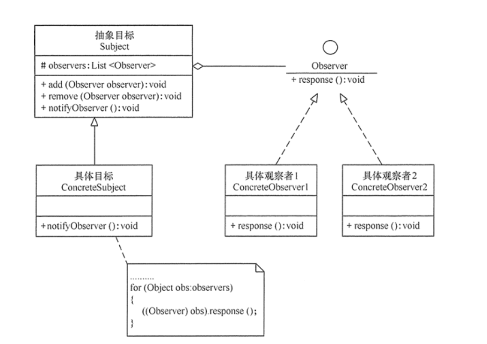
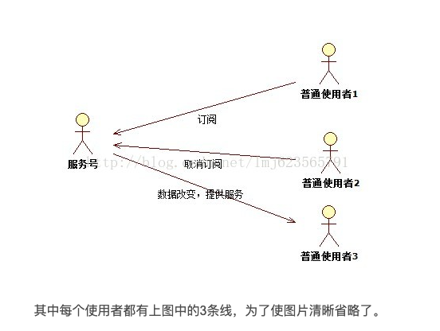

# 观察者模式 Observer pattern

### 1. 定义与特点

定义:

**指多个对象间存在一对多的依赖关系，当一个对象的状态发生改变时，所有依赖于它的对象都得到通知并被自动更新**

优点:

1. 降低了目标与观察者之间的耦合关系，两者之间是抽象耦合关系。符合依赖倒置原则
2. 目标与观察者之间建立了一套触发机制

缺点:

1. 目标与观察者之间的依赖关系并没有完全解除，而且有可能出现循环引用
2. 当观察者对象很多时，通知的发布会花费很多时间，影响程序的效率

### 2. 实现

实现观察者模式时要注意具体目标对象和具体观察者对象之间不能直接调用，否则将使两者之间紧密耦合起来，这违反了面向对象的设计原则

#### 2.1 结构



1. 抽象主题（Subject）角色: 也叫抽象目标类，它提供了一个用于保存观察者对象的聚集类和增加、删除观察者对象的方法，以及通知所有观察者的抽象方法
2. 具体主题（Concrete Subject）角色：也叫具体目标类，它实现抽象目标中的通知方法，当具体主题的内部状态发生改变时，通知所有注册过的观察者对象
3. 抽象观察者（Observer）角色：它是一个抽象类或接口，它包含了一个更新自己的抽象方法，当接到具体主题的更改通知时被调用
4. 具体观察者（Concrete Observer）角色：实现抽象观察者中定义的抽象方法，以便在得到目标的更改通知时更新自身的状态

#### 2.2 实现

```java

//抽象目标
public abstract class Subject {
    protected List<Observer> observers = new ArrayList<Observer>();

    //增加观察者方法
    public void add(Observer code.observer) {
        observers.add(code.observer);
    }

    //删除观察者方法
    public void remove(Observer code.observer) {
        observers.remove(code.observer);
    }

    public abstract void notifyObserver(); //通知观察者方法
}


//具体目标
class ConcreteSubject extends Subject {
    public void notifyObserver() {
        System.out.println("具体目标发生改变...");
        System.out.println("--------------");
        for (Object obs : observers) {
            ((Observer) obs).response();
        }
    }
}

//抽象观察者
interface Observer {
    void response(); //反应
}

//具体观察者1
class ConcreteObserver1 implements Observer {
    public void response() {
        System.out.println("具体观察者1作出反应！");
    }
}

//具体观察者2
class ConcreteObserver2 implements Observer {
    public void response() {
        System.out.println("具体观察者2作出反应！");
    }
}

```

输出

```java

public class ObserverPattern {
    public static void main(String[] args) {
        Subject subject = new ConcreteSubject();
        Observer obs1 = new ConcreteObserver1();
        Observer obs2 = new ConcreteObserver2();
        subject.add(obs1);
        subject.add(obs2);
        subject.notifyObserver();
    }
}

```

### 3. 案例



如上图所示，服务号就是我们的主题，使用者就是观察者。现在我们明确下功能：

1. 服务号就是主题，业务就是推送消息

2. 观察者只需要订阅主题，只要有新的消息就会送来

3. 当不想要此主题消息时，取消订阅

4. 只要服务号还在，就会一直有人订阅

**模拟一个微信3D彩票服务号，和一些订阅者**

#### 主题接口，和观察者接口

```java

public interface Subject {
    public void registerObserver(Observer code.observer);

    public void removeObserver(Observer code.observer);

    public void notifyObservers();
}


public interface Observer {
    public void update(String msg);
}

```

#### 3D服务号的实现类

```java

public class ObjectFor3D implements Subject {
    private List<Observer> observers = new ArrayList<Observer>();
    /**
     * 3D彩票的号码
     */
    private String msg;

    @Override
    public void registerObserver(Observer code.observer) {
        observers.add(code.observer);
    }

    @Override
    public void removeObserver(Observer code.observer) {
        int index = observers.indexOf(code.observer);
        if (index >= 0) {
            observers.remove(index);
        }
    }

    @Override
    public void notifyObservers() {
        for (Observer code.observer : observers) {
            code.observer.update(msg);
        }
    }

    /**
     * 主题更新消息
     *
     * @param msg
     */
    public void setMsg(String msg) {
        this.msg = msg;

        notifyObservers();
    }


}
```

#### 模拟使用者

```java


public class Observer1 implements Observer {

    private Subject subject;

    public Observer1(Subject subject) {
        this.subject = subject;
        subject.registerObserver(this);
    }

    @Override
    public void update(String msg) {
        System.out.println("observer1 得到 3D 号码  -->" + msg + ", 我要记下来。");
    }
}


public class Observer2 implements Observer {
    private Subject subject;

    public Observer2(Subject subject) {
        this.subject = subject;
        subject.registerObserver(this);
    }

    @Override
    public void update(String msg) {
        System.out.println("observer2 得到 3D 号码 -->" + msg + "我要告诉舍友们。");
    }
    
}
```

#### 测试代码

```java


public class Test
{
	public static void main(String[] args)
	{
		//模拟一个3D的服务号
		ObjectFor3D subjectFor3d = new ObjectFor3D();
		//客户1
		Observer observer1 = new Observer1(subjectFor3d);
		Observer observer2 = new Observer2(subjectFor3d);
 
		subjectFor3d.setMsg("20140420的3D号码是：127" );
		subjectFor3d.setMsg("20140421的3D号码是：333" );
		
	}
}

```