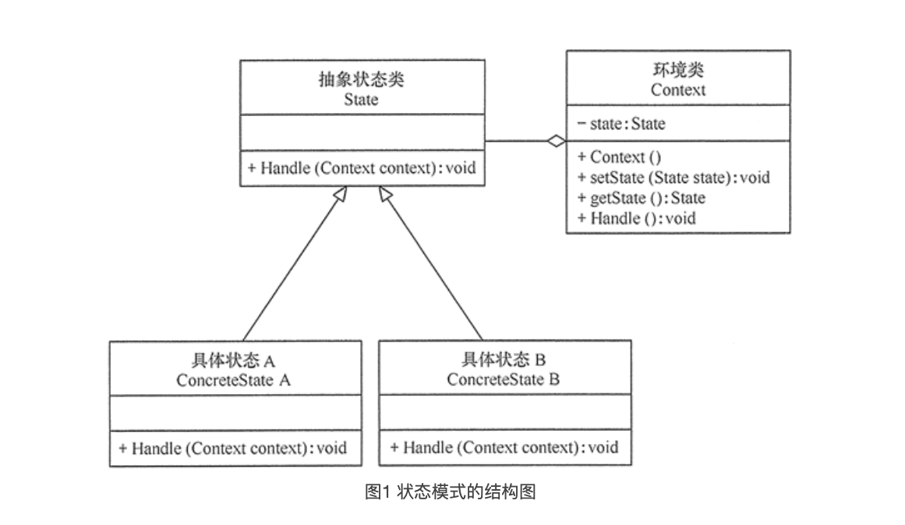
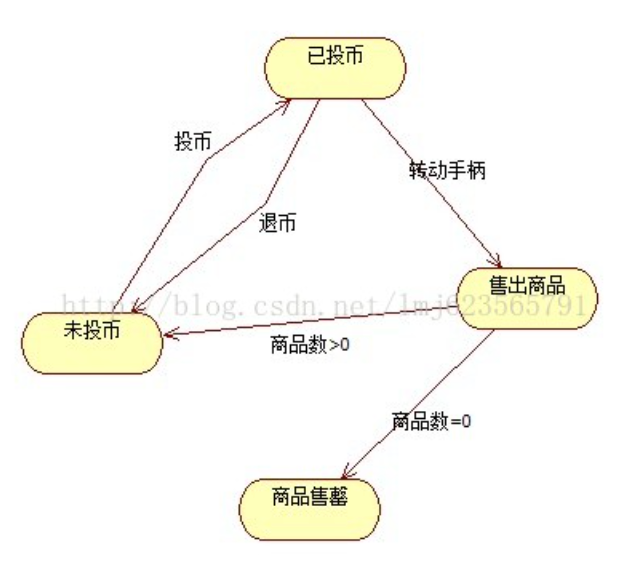

# 状态模式 State pattern

### 1. 定义与特点

#### 1.1 定义

对有状态的对象，把复杂的“判断逻辑”提取到不同的状态对象中，允许状态对象在其内部状态发生改变时改变其行为

#### 1.2 特点

##### 1.2.1 优点

1. 结构清晰，状态模式将与特定状态相关的行为局部化到一个状态中，并且将不同状态的行为分割开来，满足“单一职责原则”
2. 将状态转换显示化，减少对象间的相互依赖。将不同的状态引入独立的对象中会使得状态转换变得更加明确，且减少对象间的相互依赖
3. 状态类职责明确，有利于程序的扩展。通过定义新的子类很容易地增加新的状态和转换

##### 1.2.2 缺点

1. 状态模式的使用必然会增加系统的类与对象的个数
2. 状态模式的结构与实现都较为复杂，如果使用不当会导致程序结构和代码的混乱
3. 状态模式对开闭原则的支持并不太好，对于可以切换状态的状态模式，增加新的状态类需要修改那些负责状态转换的源码，否则无法切换到新增状态，而且修改某个状态类的行为也需要修改对应类的源码

### 2. 结构与实现

#### 2.1 模式的结构

1. 环境类（Context）角色：也称为上下文，它定义了客户端需要的接口，内部维护一个当前状态，并负责具体状态的切换
2. 抽象状态（State）角色：定义一个接口，用以封装环境对象中的特定状态所对应的行为，可以有一个或多个行为
3. 具体状态（Concrete State）角色：实现抽象状态所对应的行为，并且在需要的情况下进行状态切换



#### 2.2 模式的实现

```java

//抽象状态类
public abstract class State {
    public abstract void Handle(Context context);
}

//环境类
class Context {
    private State code.state;

    //定义环境类的初始状态
    public Context() {
        this.code.state = new ConcreteStateA();
    }

    //设置新状态
    public void setState(State code.state) {
        this.code.state = code.state;
    }

    //读取状态
    public State getState() {
        return (code.state);
    }

    //对请求做处理
    public void Handle() {
        code.state.Handle(this);
    }
}

//具体状态A类
class ConcreteStateA extends State {
    public void Handle(Context context) {
        System.out.println("当前状态是 A.");
        context.setState(new ConcreteStateB());
    }
}

//具体状态B类
class ConcreteStateB extends State {
    public void Handle(Context context) {
        System.out.println("当前状态是 B.");
        context.setState(new ConcreteStateA());
    }
}

public class StatePatternClient {
    public static void main(String[] args) {
        Context context = new Context();    //创建环境      
        context.Handle();    //处理请求
        context.Handle();
        context.Handle();
        context.Handle();
    }
}

```

### 3. 案例

#### 3.1

自动售货机



1. 包含4个状态（我们使用4个int型常量来表示）
2. 包含3个暴露在外的方法（投币、退币、转动手柄）
3. 我们需要处理每个状态下，用户都可以触发这三个动作

```java

public class VendingMachine {
    /**
     * 已投币
     */
    private final static int HAS_MONEY = 0;

    /**
     * 未投币
     */
    private final static int NO_MONEY = 1;

    /**
     * 售出商品
     */
    private final static int SOLD = 2;

    /**
     * 商品售罄
     */
    private final static int SOLD_OUT = 3;

    private int currentStatus = NO_MONEY;

    /**
     * 商品数量
     */
    private int count = 0;

    public VendingMachine(int count) {
        this.count = count;
        if (count > 0) {
            currentStatus = NO_MONEY;
        }
    }

    /**
     * 投入硬币，任何状态用户都可能投币
     */
    public void insertMoney() {
        switch (currentStatus) {
            case NO_MONEY:
                currentStatus = HAS_MONEY;
                System.out.println("成功投入硬币");
                break;
            case HAS_MONEY:
                System.out.println("已经有硬币，无需投币");
                break;
            case SOLD:
                System.out.println("请稍等...");
                break;
            case SOLD_OUT:
                System.out.println("商品已经售罄，请勿投币");
                break;

        }
    }

    /**
     * 退币，任何状态用户都可能退币
     */
    public void backMoney() {
        switch (currentStatus) {
            case NO_MONEY:
                System.out.println("您未投入硬币");
                break;
            case HAS_MONEY:
                currentStatus = NO_MONEY;
                System.out.println("退币成功");
                break;
            case SOLD:
                System.out.println("您已经买了糖果...");
                break;
            case SOLD_OUT:
                System.out.println("您未投币...");
                break;
        }
    }

    /**
     * 转动手柄购买,任何状态用户都可能转动手柄
     */
    public void turnCrank() {
        switch (currentStatus) {
            case NO_MONEY:
                System.out.println("请先投入硬币");
                break;
            case HAS_MONEY:
                System.out.println("正在出商品....");
                currentStatus = SOLD;
                dispense();
                break;
            case SOLD:
                System.out.println("连续转动也没用...");
                break;
            case SOLD_OUT:
                System.out.println("商品已经售罄");
                break;

        }
    }

    /**
     * 发放商品
     */
    private void dispense() {

        switch (currentStatus) {
            case NO_MONEY:
            case HAS_MONEY:
            case SOLD_OUT:
                throw new IllegalStateException("非法的状态...");
            case SOLD:
                count--;
                System.out.println("发出商品...");
                if (count == 0) {
                    System.out.println("商品售罄");
                    currentStatus = SOLD_OUT;
                } else {
                    currentStatus = NO_MONEY;
                }
                break;

        }

    }
    
}

```