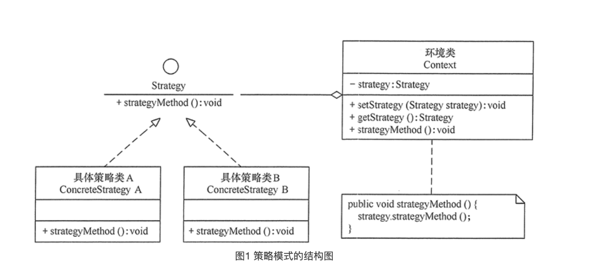

# 策略模式 Strategy Pattern

### 1. 定义与特点

#### 1.1 定义

该模式定义了一系列算法，并将每个算法封装起来，使它们可以相互替换，且算法的变化不会影响使用算法的客户

#### 1.2 优点

1. 多重条件语句不易维护，而使用策略模式可以避免使用多重条件语句，如 if...else 语句、switch...case 语句
2. 策略模式提供了一系列的可供重用的算法族，恰当使用继承可以把算法族的公共代码转移到父类里面，从而避免重复的代码
3. 策略模式可以提供相同行为的不同实现，客户可以根据不同时间或空间要求选择不同的
4. 策略模式提供了对开闭原则的完美支持，可以在不修改原代码的情况下，灵活增加新算法
5. 策略模式把算法的使用放到环境类中，而算法的实现移到具体策略类中，实现了二者的分离

### 2. 结构与实现

#### 2.1 结构



1. 抽象策略（Strategy）类：定义了一个公共接口，各种不同的算法以不同的方式实现这个接口，环境角色使用这个接口调用不同的算法，一般使用接口或抽象类实现
2. 具体策略（Concrete Strategy）类：实现了抽象策略定义的接口，提供具体的算法实现
3. 环境（Context）类：持有一个策略类的引用，最终给客户端调用

#### 2.2 实现

```java

//抽象策略类
interface Strategy {
    public void strategyMethod();    //策略方法
}

//具体策略类A
class ConcreteStrategyA implements Strategy {
    public void strategyMethod() {
        System.out.println("具体策略A的策略方法被访问！");
    }
}

//具体策略类B
class ConcreteStrategyB implements Strategy {
    public void strategyMethod() {
        System.out.println("具体策略B的策略方法被访问！");
    }
}

//环境类
class Context {
    private Strategy code.strategy;

    public Strategy getStrategy() {
        return code.strategy;
    }

    public void setStrategy(Strategy code.strategy) {
        this.code.strategy = code.strategy;
    }

    public void strategyMethod() {
        code.strategy.strategyMethod();
    }
}

```

### case

```java

public interface Strategy {
    public int doOperation(int num1, int num2);
}

public class OperationAdd implements Strategy {
    @Override
    public int doOperation(int num1, int num2) {
        return num1 + num2;
    }
}

public class OperationSubtract implements Strategy {
    @Override
    public int doOperation(int num1, int num2) {
        return num1 - num2;
    }
}

public class OperationMultiply implements Strategy {
    @Override
    public int doOperation(int num1, int num2) {
        return num1 * num2;
    }
}

public class Context {
    private Strategy code.strategy;

    public Context(Strategy code.strategy) {
        this.code.strategy = code.strategy;
    }

    public int executeStrategy(int num1, int num2) {
        return code.strategy.doOperation(num1, num2);
    }
}

public class StrategyPatternDemo {
    public static void main(String[] args) {
        Context context = new Context(new OperationAdd());
        System.out.println("10 + 5 = " + context.executeStrategy(10, 5));

        context = new Context(new OperationSubtract());
        System.out.println("10 - 5 = " + context.executeStrategy(10, 5));

        context = new Context(new OperationMultiply());
        System.out.println("10 * 5 = " + context.executeStrategy(10, 5));
    }
}

```