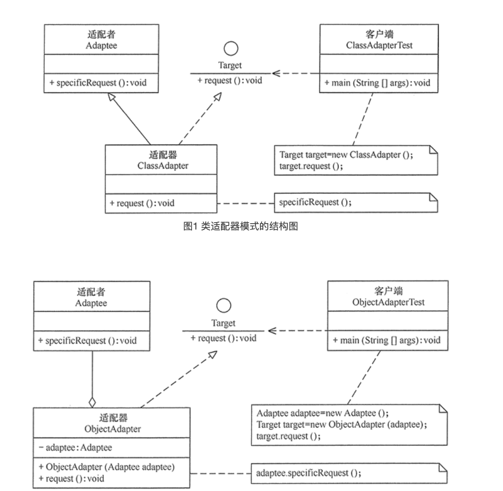

# 适配器模式 Adapter pattern

### 1.定义与特点

#### 1.1定义

将一个类的接口转换成客户希望的另外一个接口，使得原本由于接口不兼容而不能一起工作的那些类能一起工作

#### 1.2特点

1. 客户端通过适配器可以透明地调用目标接口
2. 复用了现存的类，程序员不需要修改原有代码而重用现有的适配者类
3. 将目标类和适配者类解耦，解决了目标类和适配者类接口不一致的问题
4. 在很多业务场景中符合开闭原则

### 2. 结构与实现

#### 2.1 结构



1. 目标（Target）接口：当前系统业务所期待的接口，它可以是抽象类或接口
2. 适配者（Adaptee）类：它是被访问和适配的现存组件库中的组件接口
3. 适配器（Adapter）类：它是一个转换器，通过继承或引用适配者的对象，把适配者接口转换成目标接口，让客户按目标接口的格式访问适配者

#### 2.2 实现

```java
//目标接口
interface Target {
    public void request();
}

//适配者接口
class Adaptee {
    public void specificRequest() {
        System.out.println("适配者中的业务代码被调用！");
    }
}

//类适配器类
class ClassAdapter extends Adaptee implements Target {
    public void request() {
        specificRequest();
    }
}

//客户端代码
public class ClassAdapterTest {
    public static void main(String[] args) {
        System.out.println("类适配器模式测试：");
        Target target = new ClassAdapter();
        target.request();
    }
}

```

### 3. Case

我们有一个 MediaPlayer 接口和一个实现了 MediaPlayer 接口的实体类 AudioPlayer。默认情况下，AudioPlayer 可以播放 mp3 格式的音频文件。

我们还有另一个接口 AdvancedMediaPlayer 和实现了 AdvancedMediaPlayer 接口的实体类。该类可以播放 vlc 和 mp4 格式的文件。

我们想要让 AudioPlayer 播放其他格式的音频文件。为了实现这个功能，我们需要创建一个实现了 MediaPlayer 接口的适配器类 MediaAdapter，并使用 AdvancedMediaPlayer 对象来播放所需的格式

```java

// 为媒体播放器和更高级的媒体播放器创建接口
public interface MediaPlayer {
    public void play(String audioType, String fileName);
}

public interface AdvancedMediaPlayer {
    public void playVlc(String fileName);

    public void playMp4(String fileName);
}

// 创建实现了 AdvancedMediaPlayer 接口的实体类

public class VlcPlayer implements AdvancedMediaPlayer {
    @Override
    public void playVlc(String fileName) {
        System.out.println("Playing vlc file. Name: " + fileName);
    }

    @Override
    public void playMp4(String fileName) {
        //什么也不做
    }
}

public class Mp4Player implements AdvancedMediaPlayer {

    @Override
    public void playVlc(String fileName) {
        //什么也不做
    }

    @Override
    public void playMp4(String fileName) {
        System.out.println("Playing mp4 file. Name: " + fileName);
    }
}

// 创建实现了 MediaPlayer 接口的适配器类

public class MediaAdapter implements MediaPlayer {

    AdvancedMediaPlayer advancedMusicPlayer;

    public MediaAdapter(String audioType) {
        if (audioType.equalsIgnoreCase("vlc")) {
            advancedMusicPlayer = new VlcPlayer();
        } else if (audioType.equalsIgnoreCase("mp4")) {
            advancedMusicPlayer = new Mp4Player();
        }
    }

    @Override
    public void play(String audioType, String fileName) {
        if (audioType.equalsIgnoreCase("vlc")) {
            advancedMusicPlayer.playVlc(fileName);
        } else if (audioType.equalsIgnoreCase("mp4")) {
            advancedMusicPlayer.playMp4(fileName);
        }
    }
}

// 创建实现了 MediaPlayer 接口的实体类

public class AudioPlayer implements MediaPlayer {
    MediaAdapter mediaAdapter;

    @Override
    public void play(String audioType, String fileName) {

        //播放 mp3 音乐文件的内置支持
        if (audioType.equalsIgnoreCase("mp3")) {
            System.out.println("Playing mp3 file. Name: " + fileName);
        }
        //mediaAdapter 提供了播放其他文件格式的支持
        else if (audioType.equalsIgnoreCase("vlc")
                || audioType.equalsIgnoreCase("mp4")) {
            mediaAdapter = new MediaAdapter(audioType);
            mediaAdapter.play(audioType, fileName);
        } else {
            System.out.println("Invalid media. " +
                    audioType + " format not supported");
        }
    }
}

```

输出

```java

public class AdapterPatternDemo {
    public static void main(String[] args) {
        AudioPlayer audioPlayer = new AudioPlayer();

        audioPlayer.play("mp3", "beyond the horizon.mp3");
        audioPlayer.play("mp4", "alone.mp4");
        audioPlayer.play("vlc", "far far away.vlc");
        audioPlayer.play("avi", "mind me.avi");
    }
}

```