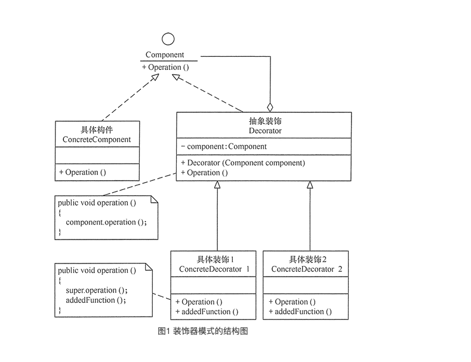

# 装饰器模式 Decorator pattern

### 1. 定义与特点

#### 1.1 定义

指在不改变现有对象结构的情况下，动态地给该对象增加一些职责（即增加其额外功能）的模式

#### 1.2 特点

1. 装饰器是继承的有力补充，比继承灵活，在不改变原有对象的情况下，动态的给一个对象扩展功能，即插即用
2. 通过使用不用装饰类及这些装饰类的排列组合，可以实现不同效果
3. 装饰器模式完全遵守开闭原则

### 2. 结构与实现

通常情况下，扩展一个类的功能会使用继承方式来实现。但继承具有静态特征，耦合度高，并且随着扩展功能的增多，子类会很膨胀。如果使用组合关系来创建一个包装对象（即装饰对象）来包裹真实对象，并在保持真实对象的类结构不变的前提下，为其提供额外的功能，这就是装饰器模式的目标



#### 2.1 结构

1. 抽象构件（Component）角色：定义一个抽象接口以规范准备接收附加责任的对象
2. 具体构件（ConcreteComponent）角色：实现抽象构件，通过装饰角色为其添加一些职责
3. 抽象装饰（Decorator）角色：继承抽象构件，并包含具体构件的实例，可以通过其子类扩展具体构件的功能
4. 具体装饰（ConcreteDecorator）角色：实现抽象装饰的相关方法，并给具体构件对象添加附加的责任

#### 2.2 实现

```java

//抽象构件角色
interface Component {
    public void operation();
}

//具体构件角色
class ConcreteComponent implements Component {
    public ConcreteComponent() {
        System.out.println("创建具体构件角色");
    }

    public void operation() {
        System.out.println("调用具体构件角色的方法operation()");
    }
}


//抽象装饰角色
class Decorator implements Component {
    private Component component;

    public Decorator(Component component) {
        this.component = component;
    }

    public void operation() {
        component.operation();
    }
}

//具体装饰角色
class ConcreteDecorator extends Decorator {
    public ConcreteDecorator(Component component) {
        super(component);
    }

    public void operation() {
        super.operation();
        addedFunction();
    }

    public void addedFunction() {
        System.out.println("为具体构件角色增加额外的功能addedFunction()");
    }
}

```

### 3. Case

我们将创建一个 Shape 接口和实现了 Shape 接口的实体类。然后我们创建一个实现了 Shape 接口的抽象装饰类 ShapeDecorator，并把 Shape 对象作为它的实例变量。

RedShapeDecorator 是实现了 ShapeDecorator 的实体类。

DecoratorPatternDemo 类使用 RedShapeDecorator 来装饰 Shape 对象

```java

// 创建一个接口
public interface Shape {
    void draw();
}

// 创建实现接口的实体类
public class Rectangle implements Shape {

    @Override
    public void draw() {
        System.out.println("Shape: Rectangle");
    }
}

public class Circle implements Shape {

    @Override
    public void draw() {
        System.out.println("Shape: Circle");
    }
}

// 创建实现了 Shape 接口的抽象装饰类
public abstract class ShapeDecorator implements Shape {
    protected Shape decoratedShape;

    public ShapeDecorator(Shape decoratedShape) {
        this.decoratedShape = decoratedShape;
    }

    public void draw() {
        decoratedShape.draw();
    }
}

// 创建扩展了 ShapeDecorator 类的实体装饰类

public class RedShapeDecorator extends ShapeDecorator {

    public RedShapeDecorator(Shape decoratedShape) {
        super(decoratedShape);
    }

    @Override
    public void draw() {
        decoratedShape.draw();
        setRedBorder(decoratedShape);
    }

    private void setRedBorder(Shape decoratedShape) {
        System.out.println("Border Color: Red");
    }
}

// 使用 RedShapeDecorator 来装饰 Shape 对象

public class DecoratorPatternDemo {
    public static void main(String[] args) {

        Shape circle = new Circle();
        ShapeDecorator redCircle = new RedShapeDecorator(new Circle());
        ShapeDecorator redRectangle = new RedShapeDecorator(new Rectangle());
        //Shape redCircle = new RedShapeDecorator(new Circle());
        //Shape redRectangle = new RedShapeDecorator(new Rectangle());
        System.out.println("Circle with normal border");
        circle.draw();

        System.out.println("\nCircle of red border");
        redCircle.draw();

        System.out.println("\nRectangle of red border");
        redRectangle.draw();
    }
}

```