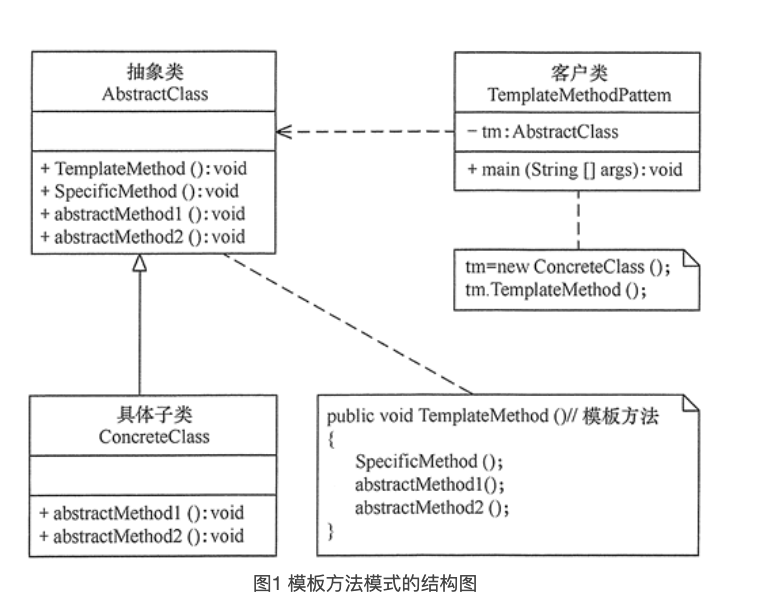

# 模板方法模式 Template pattern

### 1.定义与特点

#### 1.1 定义

定义一个操作中的算法骨架，而将算法的一些步骤延迟到子类中，使得子类可以不改变该算法结构的情况下重定义该算法的某些特定步骤

#### 1.2 特点

1. 它封装了不变部分，扩展可变部分。它把认为是不变部分的算法封装到父类中实现，而把可变部分算法由子类继承实现，便于子类继续扩展
2. 它在父类中提取了公共的部分代码，便于代码复用
3. 部分方法是由子类实现的，因此子类可以通过扩展方式增加相应的功能，符合开闭原则

### 2. 结构与实现

#### 2.1 结构



1. 抽象类/抽象模板（Abstract Class）

抽象模板类，负责给出一个算法的轮廓和骨架。它由一个模板方法和若干个基本方法构成。这些方法的定义如下

+ 模板方法: 定义了算法的骨架，按某种顺序调用其包含的基本方法
+ 基本方法: 是整个算法中的一个步骤，包含以下几种类型
    + 抽象方法：在抽象类中声明，由具体子类实现
    + 具体方法：在抽象类中已经实现，在具体子类中可以继承或重写它
    + 钩子方法：在抽象类中已经实现，包括用于判断的逻辑方法和需要子类重写的空方法两种

2. 具体子类/具体实现（Concrete Class）

具体实现类，实现抽象类中所定义的抽象方法和钩子方法，它们是一个顶级逻辑的一个组成步骤

#### 2.2 实现

```java

//抽象类
abstract class AbstractClass {
    //模板方法
    public void TemplateMethod() {
        SpecificMethod();
        abstractMethod1();
        abstractMethod2();
    }

    //具体方法
    public void SpecificMethod() {
        System.out.println("抽象类中的具体方法被调用...");
    }

    //抽象方法1
    public abstract void abstractMethod1();

    //抽象方法2
    public abstract void abstractMethod2();
}

//具体子类
class ConcreteClass extends AbstractClass {
    public void abstractMethod1() {
        System.out.println("抽象方法1的实现被调用...");
    }

    public void abstractMethod2() {
        System.out.println("抽象方法2的实现被调用...");
    }
}

```