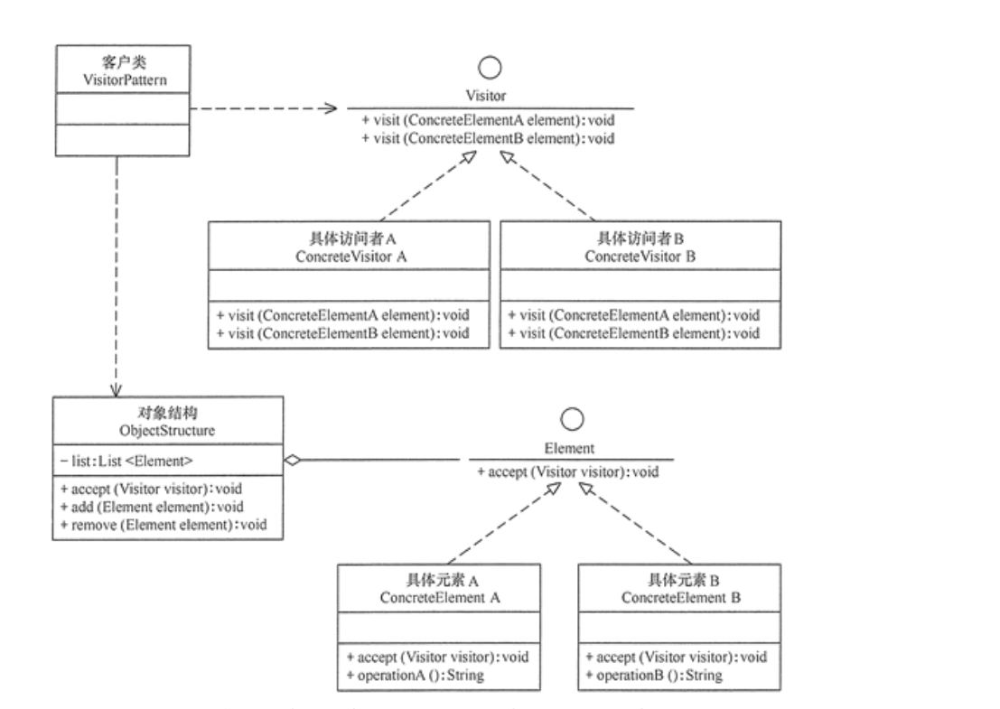

# 访问者模式 Visitor pattern

### 1. 定义与特点

#### 1.1 定义

将作用于某种数据结构中的各元素的操作分离出来封装成独立的类，使其在不改变数据结构的前提下可以添加作用于这些元素的新的操作，为数据结构中的每个元素提供多种访问方式

#### 1.2 特点

1. 扩展性好。能够在不修改对象结构中的元素的情况下，为对象结构中的元素添加新的功能
2. 复用性好。可以通过访问者来定义整个对象结构通用的功能，从而提高系统的复用程度
3. 灵活性好。访问者模式将数据结构与作用于结构上的操作解耦，使得操作集合可相对自由地演化而不影响系统的数据结构
4. 符合单一职责原则。访问者模式把相关的行为封装在一起，构成一个访问者，使每一个访问者的功能都比较单一

### 2. 结构与实现

#### 2.1 模式的结构



1. 抽象访问者（Visitor）角色：定义一个访问具体元素的接口，为每个具体元素类对应一个访问操作 visit() ，该操作中的参数类型标识了被访问的具体元素
2. 具体访问者（ConcreteVisitor）角色：实现抽象访问者角色中声明的各个访问操作，确定访问者访问一个元素时该做什么
3. 抽象元素（Element）角色：声明一个包含接受操作 accept() 的接口，被接受的访问者对象作为 accept() 方法的参数
4. 具体元素（ConcreteElement）角色：实现抽象元素角色提供的 accept() 操作，其方法体通常都是 visitor.visit(this) ，另外具体元素中可能还包含本身业务逻辑的相关操作
5. 对象结构（Object Structure）角色：是一个包含元素角色的容器，提供让访问者对象遍历容器中的所有元素的方法，通常由 List、Set、Map 等聚合类实现

#### 2.2 实现

```java

//抽象访问者
interface Visitor {
    void visit(ConcreteElementA element);

    void visit(ConcreteElementB element);
}

//具体访问者A类
class ConcreteVisitorA implements Visitor {
    public void visit(ConcreteElementA element) {
        System.out.println("具体访问者A访问-->" + element.operationA());
    }

    public void visit(ConcreteElementB element) {
        System.out.println("具体访问者A访问-->" + element.operationB());
    }
}


//具体访问者B类
class ConcreteVisitorB implements Visitor {
    public void visit(ConcreteElementA element) {
        System.out.println("具体访问者B访问-->" + element.operationA());
    }

    public void visit(ConcreteElementB element) {
        System.out.println("具体访问者B访问-->" + element.operationB());
    }
}

//抽象元素类
interface Element {
    void accept(Visitor visitor);
}


//具体元素A类
class ConcreteElementA implements Element {
    public void accept(Visitor visitor) {
        visitor.visit(this);
    }

    public String operationA() {
        return "具体元素A的操作。";
    }
}

//具体元素B类
class ConcreteElementB implements Element {
    public void accept(Visitor visitor) {
        visitor.visit(this);
    }

    public String operationB() {
        return "具体元素B的操作。";
    }
}

//对象结构角色
class ObjectStructure {
    private List<Element> list = new ArrayList<Element>();

    public void accept(Visitor visitor) {
        Iterator<Element> i = list.iterator();
        while (i.hasNext()) {
            ((Element) i.next()).accept(visitor);
        }
    }

    public void add(Element element) {
        list.add(element);
    }

    public void remove(Element element) {
        list.remove(element);
    }
}

public class VisitorPattern {
    public static void main(String[] args) {
        ObjectStructure os = new ObjectStructure();
        os.add(new ConcreteElementA());
        os.add(new ConcreteElementB());
        Visitor visitor = new ConcreteVisitorA();
        os.accept(visitor);
        System.out.println("------------------------");
        visitor = new ConcreteVisitorB();
        os.accept(visitor);
    }
}

```

### Case

我们将创建一个定义接受操作的 ComputerPart 接口。Keyboard、Mouse、Monitor 和 Computer 是实现了 ComputerPart 接口的实体类。我们将定义另一个接口
ComputerPartVisitor，它定义了访问者类的操作。Computer 使用实体访问者来执行相应的动作。

VisitorPatternDemo，我们的演示类使用 Computer、ComputerPartVisitor 类来演示访问者模式的用法

```java

// 定义一个表示元素的接口
public interface ComputerPart {
    public void accept(ComputerPartVisitor computerPartVisitor);
}

// 创建扩展了上述类的实体类

public class Keyboard implements ComputerPart {

    @Override
    public void accept(ComputerPartVisitor computerPartVisitor) {
        computerPartVisitor.visit(this);
    }
}

public class Monitor implements ComputerPart {

    @Override
    public void accept(ComputerPartVisitor computerPartVisitor) {
        computerPartVisitor.visit(this);
    }
}

public class Mouse implements ComputerPart {

    @Override
    public void accept(ComputerPartVisitor computerPartVisitor) {
        computerPartVisitor.visit(this);
    }
}

public class Computer implements ComputerPart {

    ComputerPart[] parts;

    public Computer() {
        parts = new ComputerPart[]{new Mouse(), new Keyboard(), new Monitor()};
    }


    @Override
    public void accept(ComputerPartVisitor computerPartVisitor) {
        for (int i = 0; i < parts.length; i++) {
            parts[i].accept(computerPartVisitor);
        }
        computerPartVisitor.visit(this);
    }
}

// 定义一个表示访问者的接口
public interface ComputerPartVisitor {
    public void visit(Computer computer);

    public void visit(Mouse mouse);

    public void visit(Keyboard keyboard);

    public void visit(Monitor monitor);
}

// 创建实现了上述类的实体访问者

public class ComputerPartDisplayVisitor implements ComputerPartVisitor {

    @Override
    public void visit(Computer computer) {
        System.out.println("Displaying Computer.");
    }

    @Override
    public void visit(Mouse mouse) {
        System.out.println("Displaying Mouse.");
    }

    @Override
    public void visit(Keyboard keyboard) {
        System.out.println("Displaying Keyboard.");
    }

    @Override
    public void visit(Monitor monitor) {
        System.out.println("Displaying Monitor.");
    }
}


```

输出

```java

public class VisitorPatternDemo {
    public static void main(String[] args) {

        ComputerPart computer = new Computer();
        computer.accept(new ComputerPartDisplayVisitor());
    }
}

```